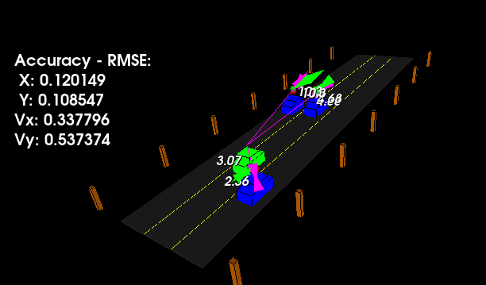
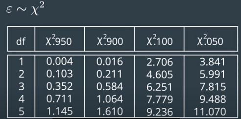
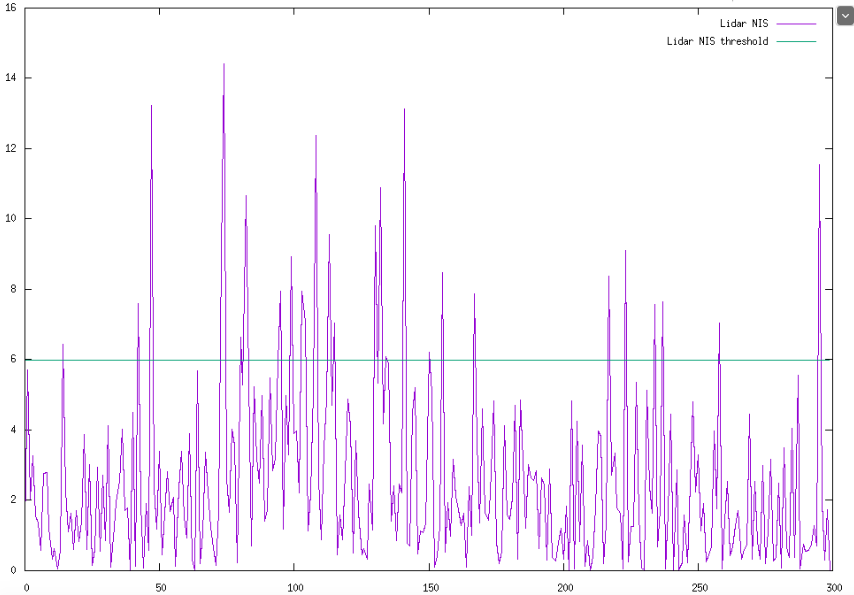

# Unscented Kalman Filter
This repository contains the implementation of an unscented kalman filter (UKF) for object tracking in 3D space



## Processus explanations

In order to track multiple cars in the environment of our vehicule, we use radar et lidar sensors to collect data describing the localization and motion of the surroundings cars.

Lidar sensor gives a position information.
Radar sensor gives a range, angle and velocity information.

To benefit from both sensors we are using an Unscented Kalman Filter (UKF) that fuses the different information and estimates position, velocity, yaw angle and yaw rate of tracked vehicles.

Here are the main steps of the UKF:

Prediction step:

	- Generate sigma points
	- Predict sigma points
	- Predict mean and covariance

Update step:

	- Predict measurement
	- Update State

## Consistency Check

In the program, it is possible to run a consistency check based on the Normalized Innovation Squared (NIS) parameter. The NIS value follows a chi-squared distribution. The following table tells us what kind of value we should expect:



The code plots the NIS value for each prediction step and for each sensor, those values are compared to specific threshold depending on the number of degree of freedom (dimension of measurement space).

For example, if we look at the lidar sensor (2 dof), 95% of NIS values must be lower than 5.991 to have a consistent filter.


# Dependencies

- [gnuplot](https://sourceforge.net/p/gnuplot/gnuplot-main/ci/master/tree/)
- [gnuplot-iostream](https://github.com/dstahlke/gnuplot-iostream)

# Clone, build and run

Retrieve the source code:
```
git clone git@github.com:sando92/unscented_kalman_filter.git

cd unscented_kalman_filter
mkdir build
cd build
cmake ..
make ..

./ukf_highway
```
